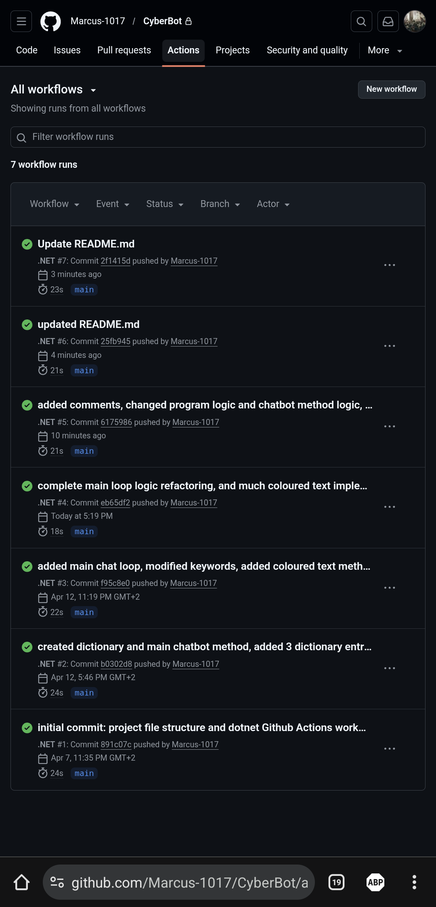
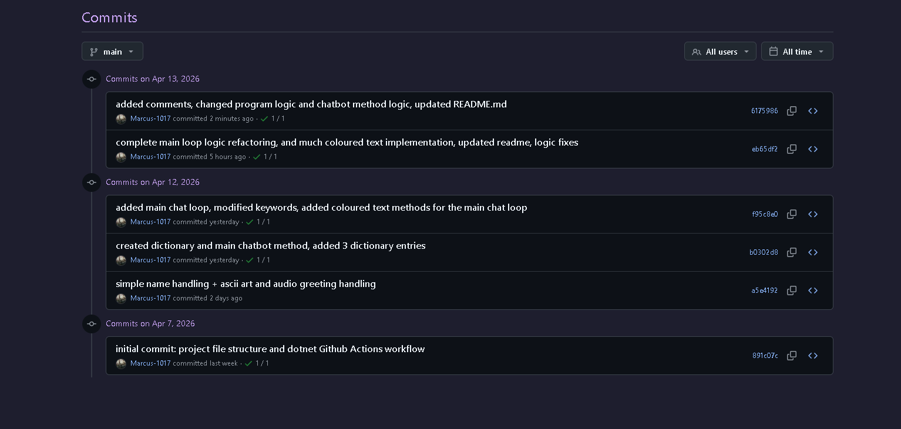

# CyberBotApp

A cybersecurity awareness chatbot built in C#, available as a console app (Part 1) and a WPF GUI (Parts 2 & 3).

## Projects
- **CyberBot** — console application (Part 1)
- **CyberBotGUI** — WPF GUI application (Parts 2 & 3)

## How to run

### Console app (Part 1)
Clone this repository, navigate to the console project:
```bash
cd CyberBot
dotnet run
```

### GUI app (Parts 2 & 3)
Open `CyberBotApp.slnx` in Visual Studio and run `CyberBotGUI`.

## Requirements
- .NET 10.0 or later
- Windows (WPF is Windows-only)
- Newtonsoft.Json NuGet package (install via NuGet Package Manager)

## Topics
- Passwords
- Phishing
- Internet privacy
- Social media safety
- Safe browsing
- Internet scams
- Software updates

## Features

### Part 1 (Console)
- Voice greeting on launch
- ASCII art logo display
- Text-based chat interface
- Coloured console output

### Part 2 (GUI)
- WPF graphical user interface
- Keyword recognition (passwords, phishing, privacy, scams, browsing, social media, updates)
- Random responses for varied conversations
- Memory and recall of favourite topics
- Sentiment detection (worried, scared, confused, frustrated, anxious)
- Follow-up support ("tell me more", "explain", "another tip")
- Personalised responses using user's name

### Part 3 (Advanced)
- Task Assistant with reminders (add, view, complete, incomplete, delete)
- Persistent JSON storage (`tasks.json`)
- Cybersecurity Quiz with 12 questions, immediate feedback, and final score
- Activity Log with timestamps (shows last 10 entries, "Show Full Log" option)
- NLP simulation via chat: add tasks, start quiz, show activity log
- Reminder follow-up after adding tasks via chat

## Chat Commands
- `add task to [title]` — Add a new task
- `remind me to [title]` — Add a task with reminder intent
- `start quiz` — Launch the cybersecurity quiz
- `show activity log` — View recent activity
- `show more` — View full activity log history
- `tell me more` — Get another tip on current topic
- `help` — Show available commands

## YouTube
[Part 1 presentation](https://youtu.be/BtPp5oNgwtY)
[Part 2 presentation](https://youtu.be/CrVPz4Gxxf8)
[Part 3 presentation](https://youtu.be/thisIsAPlaceholder)

## CI Status



## Author
Marcus Johnson  
ST10496028  
PROG6221 - Programming 2A
